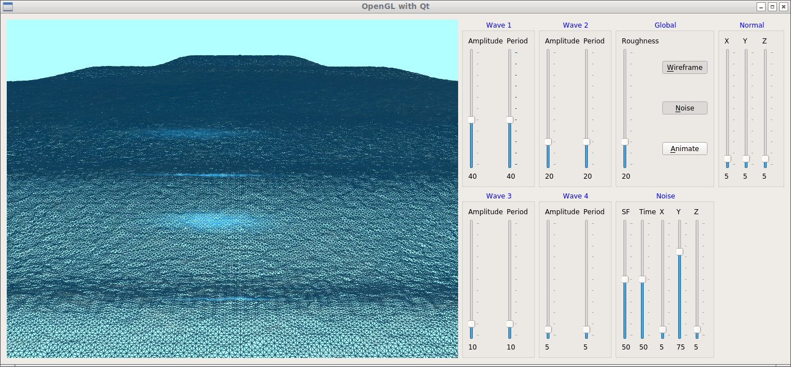

# OpenGL Demos
A collection of simple OpenGL demos which I developed over the years.

## Demos
* image       : a simple png front end used by many other demos
* butterfly   : dabbling with geometry shaders
* cdlod_tess  : dabbling with tessellation shaders
* qt-culling  : distance culling with quadtrees
* water       : displacement with geometric waves + high frequency noise
* qt-water    : the water demo within a Qt framework

## Built With

* [GLFW](http://www.glfw.org/) - The interface with the window system
* [glad](https://github.com/Dav1dde/glad) - The OpenGL loader/generator
* [TinyXML2](http://www.grinninglizard.com/tinyxml2/) - A simple, small, efficient C++ XML parser
* [glm](https://glm.g-truc.net/0.9.8/index.html) - OpenGL Mathematics
* [Assimp](http://assimp.sourceforge.net/) - Open Asset Import Library
* [webgl-noise](https://github.com/stegu/webgl-noise) - Simplex noise function
* [Dear ImGui] (https://github.com/ocornut/imgui) - Bloat-free Immediate Mode Graphical User interface

## Acknowledgments
[The OpenGL SuperBible](http://www.openglsuperbible.com/) - Graham Sellers, Richard S. Wright Jr., Nicholas Haemel