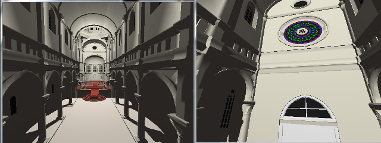

## First jab at the RadeonRays SDK: mainly the CornellBoxShadow tutorial but dynamic (moving camera and light).

## Main issues:
1. Resizing doesn't work, I still have to figure out how to handle the **openCL buffers**(via CLW)
2. ~~The perspective camera looks pretty funky~~
3. ~~Track down the (possibly race condition?) that sometime causes api->mesh to segfault~~

## Things I'd like to add:
* ~~Cmake~~ Test meson in windows
* It would be nice to use an openCL buffer for the camera (as in the original). But how to update it!?
* ~~A somewhat more complex scene~~
* Obviously reflections (glossy?) and refractions
* Antialiasing (~~FXAA~~ and/or (adaptative) supersampling)
* Add area lights
* Add soft shadows
* Add a more complex camera model (for instance depth of field)
* Diffuse interreflection?
* Diffuse textures (normal maps?)
* Heck, it would also be nice to use montecarlo generation and denoising!

## Built With
* [RadeonRays](https://github.com/GPUOpen-LibrariesAndSDKs/RadeonRays_SDK) - The amazing folks at AMD/Radeon doing their best
* [GLFW](http://www.glfw.org/) - The interface with the window system
* [GLEW](http://glew.sourceforge.net/) - The cross-platform open-source C/C++ extension loading library
* [tinyobjloader](https://github.com/syoyo/tinyobjloader) - A single-header library for loading Wavefront OBJ files

## Acknowledgements
* [Norbert Nopper](https://github.com/McNopper) - Supercool OpenGL 3/4 examples
