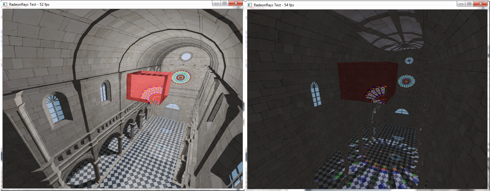

## First jab at the RadeonRays SDK: mainly the CornellBoxShadow tutorial but dynamic (moving camera and light), with textures and refraction.

## Things I'd like to add:
* Reflections (WIP)
* Light refraction and reflection
* Bump maps
* Depth of field
* Soft shadows

## Sibenik by Marko Dabrovic

with holes corrected by Kenzie Lamar at Vicarious Visions and high-resolution texture and bump maps painted by Morgan McGuire. Originally from [hdri](http://hdri.cgtechniques.com/~sibenik2/download/).

## Built With
* [RadeonRays](https://github.com/GPUOpen-LibrariesAndSDKs/RadeonRays_SDK) - The amazing folks at AMD/Radeon doing their best
* [GLFW](http://www.glfw.org/) - The interface with the window system
* [GLEW](http://glew.sourceforge.net/) - The cross-platform open-source C/C++ extension loading library
* [tinyobjloader](https://github.com/syoyo/tinyobjloader) - A single-header library for loading Wavefront OBJ files
* [stb image](https://github.com/nothings/stb) - A single-header library for loading image files

## Acknowledgements
* [Norbert Nopper](https://github.com/McNopper) - Supercool OpenGL 3/4 examples
